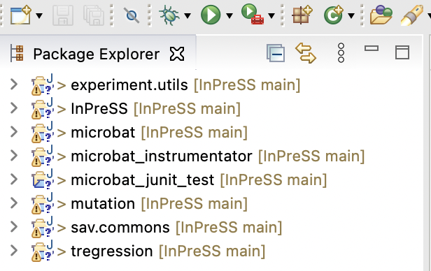

# CoReX: Context-Aware Refinement-Based Slicing for Debugging Regression Failures

This repository hosts CoReX, a regression analysis technique based on dual-version program slicing.
Given a test case that passes on one version and fails on another, CoReX automatically identifies and prioritizes code statements relevant to the failure. Rather than producing a single flat slice, CoReX distinguishes between primary, secondary, and irrelevant statements—helping developers focus first on the most critical information while still retaining useful context.

CoReX builds on prior dual-version slicing techniques but introduces a more structured and developer-aligned view of failure-related code. The resulting prioritized slices are designed to support iterative debugging and have been shown to outperform existing methods in both accuracy and developer alignment.

## Citation

If you need to reference our technique, please use the following citations:

Sahar Badihi and Julia Rubin. "CoReX: Context-Aware Refinement-Based Slicing for Debugging Regression Failures." The IEEE/ACM International Conference on Software Engineering (ICSE), 2026. 

---
---

## Table of Contents
1. [Requirements](#Requirements)
2. [Building the Tool](#Building-the-Tool)
3. [Running the Tool](#Running-the-Tool)

---
---

## Requirements

* Running platform: Linux or MacOS

* Java Runtime Environment version: 8

* Eclipse version: 4.16

---
---
## Building CoREX on your machine

CoReX relies on the TRegression (ERASE) (https://github.com/llmhyy/tregression) project to align the two traces. 
It also relies on Slicer4J (https://github.com/resess/Slicer4J) to compute control and data-flow dependencies. 
As these projects are developing separately, to prevent any inconsistencies between the tool versions that we used and newer versions, 
we included the repositories of Slicer4J, ERASE, and its underlying Microbat (https://github.com/llmhyy/microbat) project.

1. Start with cloning the repository:
````yaml
git clone https://github.com/resess/CoReX.git
````
In this repo, we provide:
- microbat: including all microbat subprojects
- tregression
- Slicer4J
- CoReX

Note that CoReX, Microbat, and TRegression projects are Eclipse plugin project. 

2. You need to import the following projects through "Existing Projects into Workspace":



- CoReX
- mirobat/experiment.utils
- microbat/mirobat
- mirobat/microbat_instrumentator
- mirobat/microbat_junit_test
- mirobat/mutation
- mirobat/sav.commons
- tregression/tregression

---
--- 

<!-- ## Running the Tool through Script

Please follow the Readme file which we provided with the tool on zenodo: https://doi.org/10.5281/zenodo.7684134 -->

---
--- 

## Running the Tool Manually Through the Plugin 
### General guideline: Running with Main() method in Run
Now, you can run CoReX through the main method in the run class (run as "Java Application"):


The main method takes as input following four arguments: 
- the path to the base folder, including two versions (See below for our subjects and Defects4J). 
- The benchmark name to run: InPreSS, Math, Closure, ....
- The bug_id
- The failing test

Here is an example of the structure of the bug repositories:


---

### Running on InPreSS Subjects
As running the client and library projects needs merging two projects in one and creating a merged jar to run Slicer4J, we provide the merged and ready to run folders in a Zenodo zip file (https://zenodo.org/record/7683853/files/InPreSSBench.zip?download=1).

The structure of the folder is as follows:

|__ InPreSS<br />
&nbsp;&nbsp;&nbsp;&nbsp;&nbsp;&nbsp;|__ 1 <br />
&nbsp;&nbsp;&nbsp;&nbsp;&nbsp;&nbsp;|__ 2 <br /> 
&nbsp;&nbsp;&nbsp;&nbsp;&nbsp;&nbsp;|__ ...<br />

Here is an example of running bug_id 6 of InPreSS subjects:


Where, the base folder storing the InPreSS subjects is "Users/sahar1/Documents/Projects/bug_repos/". 
"InPreSS" is the name of the benchmark to run. 
Bug_id is 6 and the failing test is "com.intuit.wasabi.export.rest.impl.DefaultRestEndPointTest::testGetRestEndPointURI".

The failing test (test_class::test_method) is stored in the "failing_tests" file in the buggy version of each subject. 

---

### Running on Defects4J
You can download the ready-to-use Defects4J benchmarks from zenodo: https://zenodo.org/record/7683853#.Y_3L1y-975g.
You can also follow the instructions in https://github.com/llmhyy/tregression to create the Defects4J Benchmarks: 
The structure of Defects4J is as follows:

|__ Math<br />
&nbsp;&nbsp;&nbsp;&nbsp;&nbsp;&nbsp;|__ 1 (bug_id)<br />
&nbsp;&nbsp;&nbsp;&nbsp;&nbsp;&nbsp;|__ 2 (bug_id)<br />
&nbsp;&nbsp;&nbsp;&nbsp;&nbsp;&nbsp;|__ ...<br />
|__ Closure<br />
&nbsp;&nbsp;&nbsp;&nbsp;&nbsp;&nbsp;|__ 1 (bug_id)<br />
&nbsp;&nbsp;&nbsp;&nbsp;&nbsp;&nbsp;|__ 2 (bug_id)<br />
&nbsp;&nbsp;&nbsp;&nbsp;&nbsp;&nbsp;|__ ...<br />

You can run each bugs similar to running our subjects. 